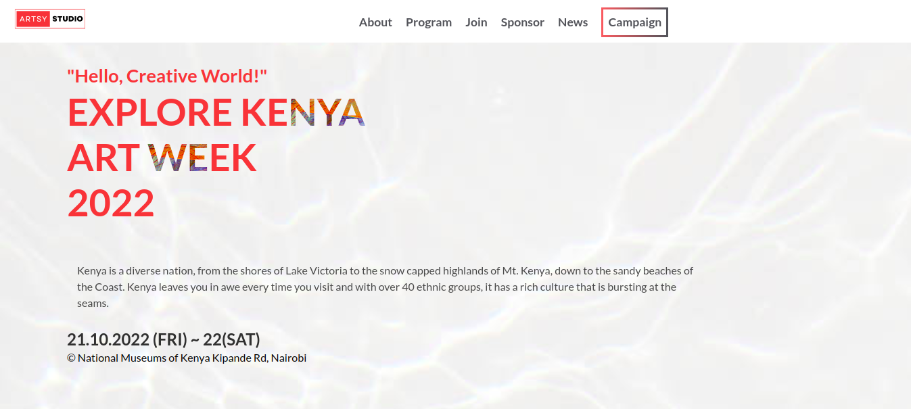

## Conference-Website

- This is a website for an Art Week event that contains all the program's itinerary including the speakers, partners, a snippet of previous events, and a little bit more information to better help you engage more with the brand. 
## Screenshot of the project



## Built With

- HTML

- CSS
  
- SASS

- Javascript 

- Lighthouse (An open-source, automated tool for improving the quality of web pages. It has audits for performance, accessibility, progressive web apps, SEO and more).

- Webhint (A customizable linting tool that helps you improve your site's accessibility, speed, cross-browser compatibility, and more by checking your code for bestpract ices and common errors).

- Stylelint (A mighty, modern linter that helps you avoid errors and enforce conventions in your styles).

### Prerequisites

- Have a local version control like Git. Which is a open source distributed version control system designed for source code management.
- A text editor (e.g Visual Studio Code, Vim, Atom & Sublime.)
- A web browser (e.g Chrome, Safari, Mozilla Firefox.)
- Live Server which is a web extension that helps you to live reload feature for dynamic content.
- Install wave extension to check project accessibilty.

### Live Demo
- Here's the [live link](https://www.loom.com/share/87858677e9c740abbdf4e7646deae94a) representation on loom

- To view a live demo of the project you can click on this [link](https://ginabeki.github.io/Conference-Website/).

### Getting Started

To get a local copy up and running follow these simple example steps.

- npm
  ```sh
  npm install npm@latest -g
  ```

### Installation

1. Clone the repo by running the command
   ```sh
    git clone https://github.com/ginabeki/Conference-Website.git
   ```
2. Open the directory of the project
   ```sh
   cd Conference-Website
   ```
3. Open the html file
   ```sh
   Click and open the html file

## Authors

👤 Gina Beki

- GitHub: [@ginabeki](https://github.com/ginabeki)
- Twitter: [@_gina_bw](https://twitter.com/_gina_bw)
- LinkedIn: [@Gina Beki](https://www.linkedin.com/in/gina-beki-a85846103/)

## 🤝 Contributing

- Contributions, issues, and feature requests are welcome!

- Feel free to check the [issues page](https://github.com/ginabeki/Conference-Website/issues).

## Show your support

- Give a ⭐️ if you like this project!

## Acknowledgements

- Original design by Cindy Shin in [Behance](https://www.behance.net/gallery/29845175/CC-Global-Summit-2015)
- Background images by Drew Beamer in [Unsplash](https://unsplash.com/photos/kUHfMW8awpE)
- Ethiopia background by DMEPhotography in [Unsplash](https://unsplash.com/s/photos/passport-photos)

## 📝 License

- This project is MIT licensed.
